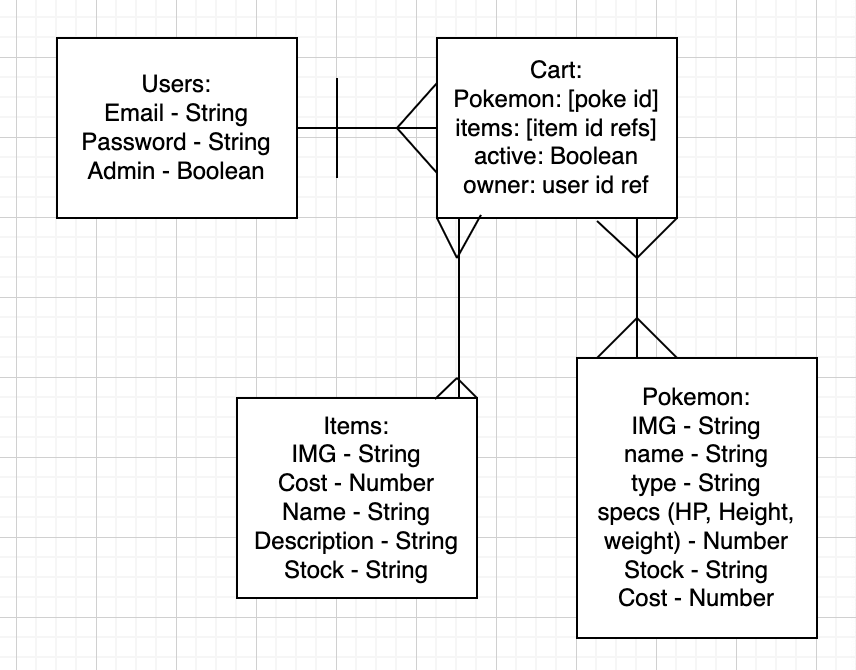

# poke-store-api

An api to serve data for a poke shop

## Prompt

E-Commerce Store

## Installation

## Structure

## API

### Authentication

| Verb   | URI Pattern            | Controller#Action |
|--------|------------------------|-------------------|
| POST   | `/sign-up`             | `users#signup`    |
| POST   | `/sign-in`             | `users#signin`    |
| PATCH  | `/change-password/` | `users#changepw`  |
| DELETE | `/sign-out/`        | `users#signout`   |
| POST   | `/items`  | `item#create`  |
| GET   | `/items`  | `get#item`  |
| GET   | `/items/:id`  | `get#item.id`  |
| PATCH  | `/items/:id` | `item#update`  |
| PATCH  | `/items/:id/stock` | `update#itemStock`  |
| DELETE  | `items/:id`  | `item#delete.` |
| GET   | `/carts`  | `get#cart`  |
| POST   | `/carts`  | `create#cart`  |

## About

## Roles

    -Project Manager: Christian Brewer
    -Front-end SME: Mahider Mengiste
    -Back-end SME: Jaden Ruplal

## ERD

## API

https://pokeapi.co/?ref=public-apis

